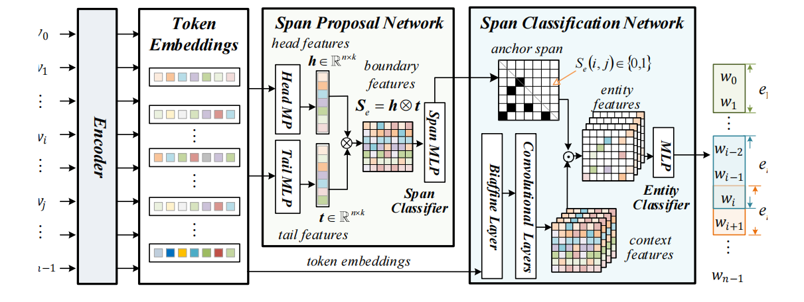

# Named Entity Recognition Based on Anchor Span for Manufacturing Knowledge Extraction

## 1.Introduction
This repository contains code introduced in the following paper:
 
**[Named Entity Recognition Based on Anchor Span for Manufacturing Knowledge Extraction](https://www.sciencedirect.com/science/article/pii/S0952197625027241?dgcid=author)**  
Yahui Li, Qi Sun, Chunjie Zhou, Lu Liu and Yu-Chu Tian In *Engineering Applications of Artificial Intelligence (EAAI)*, 2025

> Named Entity Recognition (NER) serves as a fundamental component of knowledge-based intelligent manufacturing systems, enabling the transformation of unstructured text into structured semantic information. However, current NER approaches face challenges in handling multiple levels of entity nesting in knowledge extraction, especially with high information density embedded in short text. To address this issue, an Anchor Span-based NER (ASNER) approach is introduced, which combines token and span classification for accurate and efficient extraction of manufacturing knowledge. It utilizes a boundary match neural network based on the head and tail features of entities to generate the corresponding anchor span of potential entities, enabling precise and robust entity localization in diverse contexts. Subsequently, the approach extracts token spatial contextual features by using biaffine attention and convolutional neural networks, and assigns classification categories to the anchor span-filtered entity features. Experimental studies demonstrate the effectiveness of the proposed ASNER approach.

## 2.Architecture
<p align="center">
  
</p>

## 3.Setup Environments
* The code is written in Python 3.1x using pytorch 2.x framework.  
* Before starting, you need to install all the required packages listed in the requirment.txt using `pip install -r requirements.txt`.
* Then create `huggingface` folder and download the ALBERT models to it. For English we used the [albert-base-v2 model](https://huggingface.co/albert/albert-base-v2) and for Chinese we used the [calbert-base-chinese-cluecorpussmall]( https://huggingface.co/uer/albert-base-chinese-cluecorpussmall).

## 4.Dataset
- [ACE 2004](https://catalog.ldc.upenn.edu/LDC2005T09)
- [ACE 2005](https://catalog.ldc.upenn.edu/LDC2006T06)
- [GENIA](http://www.geniaproject.org/genia-corpus)
- [Conll 2003](https://www.clips.uantwerpen.be/conll2003/ner/)
- [OntoNotes 4.0](https://catalog.ldc.upenn.edu/LDC2011T03)
- [MSRA](https://github.com/ShannonAI/mrc-for-flat-nested-ner/blob/master/ner2mrc/download.md)

## 5.Preparation
- Download dataset
- Process them to fit the same format as the following example:
``` json
  [
    {"text": "粗汽油量小，分馏塔顶油气分离器(d201)液面高。", 
     "entities": [ ["汽油","MAT"], ["粗汽油","MAT"],["粗汽油量","MET"], ["粗汽油量小","PAR"],
                   ["分馏塔","EQU"], ["油气分离器","EQU"], ["分馏塔顶油气分离器", "EQU"], 
                   ["D201", "EQU"], ["分馏塔顶油气分离器(D201)", "EQU"], 
                   ["分馏塔顶油气分离器液面", "MET"], ["分馏塔顶油气分离器液面高", "PAR"]]
    }
  ]
  ```
- Create and Put the processed data into the directory `datasets/`
   
* Each of the sentences in the batch corresponds to a list of NEs stored under `entities` key, if some sentences do not contain NEs use an empty list `[]` instead.

## 6.Training and Evaluation
```bash
>> python train/asner_albert.py --dataset ACE04 --bert_name albert-base-v2
```

## 8. License

This project is licensed under the MIT License - see the [LICENSE](LICENSE) file for details.
